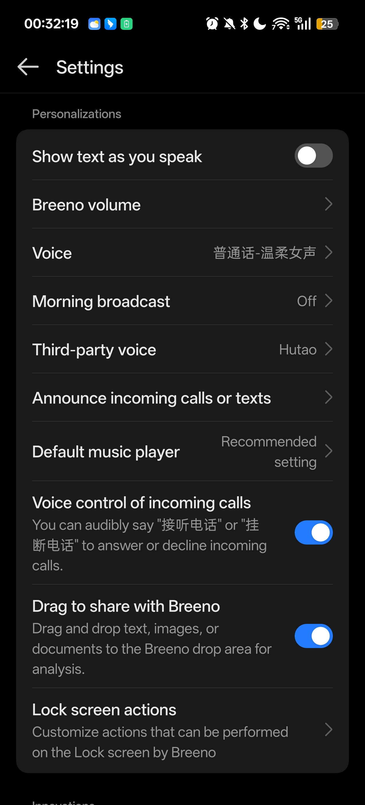
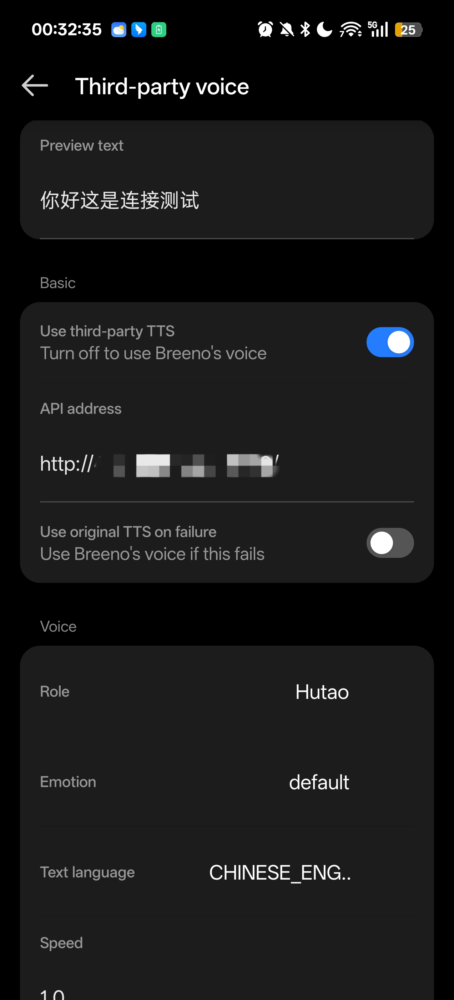

<div align="right">

[English](README.en.md) | [中文](README.md)

</div>

```
██████╗  ██╗   ██╗ ██████╗ ██╗  ██████╗ ███████╗
██╔══██╗ ██║   ██║██╔═══██╗██║ ██╔════╝ ██╔════╝
██████╔╝ ╚██╗ ██╔╝██║   ██║██║ ██║      █████╗
██╔══██╗  ╚████╔╝ ██║   ██║██║ ██║      ██╔══╝
██████╔╝   ╚██╔╝  ╚██████╔╝██║ ╚██████╗ ███████╗
╚═════╝     ╚═╝    ╚═════╝ ╚═╝  ╚═════╝ ╚══════╝
```

<p align="center">
  <a href="https://github.com/Loanio/BVoice"></a>
  <a href="https://github.com/Loanio/BVoice/releases/latest"></a>
  <a href="https://github.com/Loanio/BVoice/releases/latest"></a>
</p>

<p align="center">
  Android · LSPosed · YukiHookAPI · GPT-SoVITS · Breeno Assistant
</p>

# BVoice

An Android LSPosed module that connects Breeno Assistant to a self-hosted GPT-SoVITS service.

BVoice provides both a standalone module app and an in-app Breeno settings entry. They share the same local configuration for voice selection, connection checks, previews, and speech synthesis.

## Screenshots

| Breeno settings | Third-party voice |
| --- | --- |
|  |  |

## Backend

This module can use [Uni-TTS](https://github.com/X-T-E-R/Uni-TTS) as its TTS backend. See the [Uni-TTS API documentation](https://www.yuque.com/xter/zibxlp/kkicvpiogcou5lgp) for the available API details.

> [!IMPORTANT]
> **Beta software.** Features, compatibility, and stability are still being validated and may change. The module currently supports only the Breeno Assistant versions listed in [Compatibility](#compatibility).

## Contents

- [Screenshots](#screenshots)
- [Backend](#backend)
- [Features](#features)
- [Architecture](#architecture)
- [Compatibility](#compatibility)
- [Download](#download)
- [Installation and configuration](#installation-and-configuration)
- [Settings](#settings)
- [Build from source](#build-from-source)
- [Project layout](#project-layout)
- [Diagnostics and feedback](#diagnostics-and-feedback)

## Features

- Adds GPT-SoVITS speech synthesis to Breeno Assistant's TTS pipeline.
- Loads character and emotion catalogs; supports manual voice settings, connection checks, and voice previews.
- Supports streaming responses and WAV, PCM, MP3, and OGG audio formats.
- Plays generated audio through `AudioTrack`, with cancellation and session management.
- Falls back to Breeno's original TTS until third-party audio starts, when enabled in the configuration.
- Shares versioned configuration between the module app and Breeno's embedded settings page.
- Includes Chinese and English settings UI, copyable diagnostic logs, and privacy-aware utterance identifiers.

## Architecture

```text
Breeno Assistant
    |
    v
LSPosed / YukiHookAPI
    |
    +-- 12.9.9 Engine / streaming TTS route
            |
            v
      GptSovitsClient
            |
            +-- GET /character_list
            +-- POST /tts
                    |
                    v
              AudioTrack playback
```

Configuration is read and written through the module's `ContentProvider` and stored in its own `SharedPreferences`. The Breeno process only reads this shared configuration.

## Compatibility

| Component | Supported configuration |
| --- | --- |
| Android | minSdk 31, targetSdk 35 |
| Root environment | Magisk or KernelSU with LSPosed |
| Breeno Assistant 12.9.9 | Engine and streaming TTS routes |
| GPT-SoVITS service | `GET /character_list` and `POST /tts` |

## Download

- [BVoice Debug APK](https://github.com/Loanio/BVoice/releases/download/v0.1.0/BVoice-0.1.0-debug.apk) — signed with the Android debug key.
- [BVoice Release APK](https://github.com/Loanio/BVoice/releases/download/1-0.1.0/BVoice-0.1.0-release-signed.apk) — signed with the official release key.

## Installation and configuration

1. Install the module APK.
2. Enable the module in LSPosed and set its scope to `com.heytap.speechassist`.
3. Restart Breeno Assistant.
4. Open the BVoice app, or open **Third-party voice** in Breeno settings.
5. Enter the GPT-SoVITS service address, load the character and emotion catalog, and run a preview.
6. Enable **Use third-party TTS**.

## Settings

| Category | Available settings |
| --- | --- |
| Basic | Enable state, service address, failure fallback |
| Voice | Character, emotion, text language, manual voice |
| Synthesis | Audio format, streaming response, speech rate, and generation parameters |
| Network | Connection and read timeouts |
| Diagnostics | Strict mode, module player, log level, and preview text |

## Build from source

Requirements: JDK 17 and Android SDK 35.

```powershell
$env:JAVA_HOME = 'C:\Program Files\Java\jdk-17'
.\gradlew.bat :app:testDebugUnitTest :app:assembleDebug
```

The debug APK is written to [`app/build/outputs/apk/debug/app-debug.apk`](app/build/outputs/apk/debug/app-debug.apk).

To build the release variant:

```powershell
.\gradlew.bat :app:assembleRelease
```

The release APK must be signed with your own release key before it can be installed. Run the project verification script with:

```powershell
.\scripts\verify.ps1
```

## Project layout

```text
app/src/main/java/dev/breenottshook/
├── api/       GPT-SoVITS client, character catalog, and diagnostics
├── audio/     Audio decoding and format models
├── config/    Shared configuration, validation, encoding, and persistence
├── hook/      LSPosed injection, version routing, and host adapters
├── playback/  AudioTrack playback and streaming writes
├── session/   TTS sessions and cancellation control
└── ui/        Module app and embedded settings UI
```

Key entry points: [hook implementation](app/src/main/java/dev/breenottshook/hook), [configuration](app/src/main/java/dev/breenottshook/config), [settings UI](app/src/main/java/dev/breenottshook/ui), and the [Android manifest](app/src/main/AndroidManifest.xml).

## Diagnostics and feedback

Copy the diagnostic log from the bottom of the settings page. When reporting an issue, include the device model, Android/ColorOS version, Breeno version, LSPosed version, reproduction steps, and a redacted diagnostic log.
